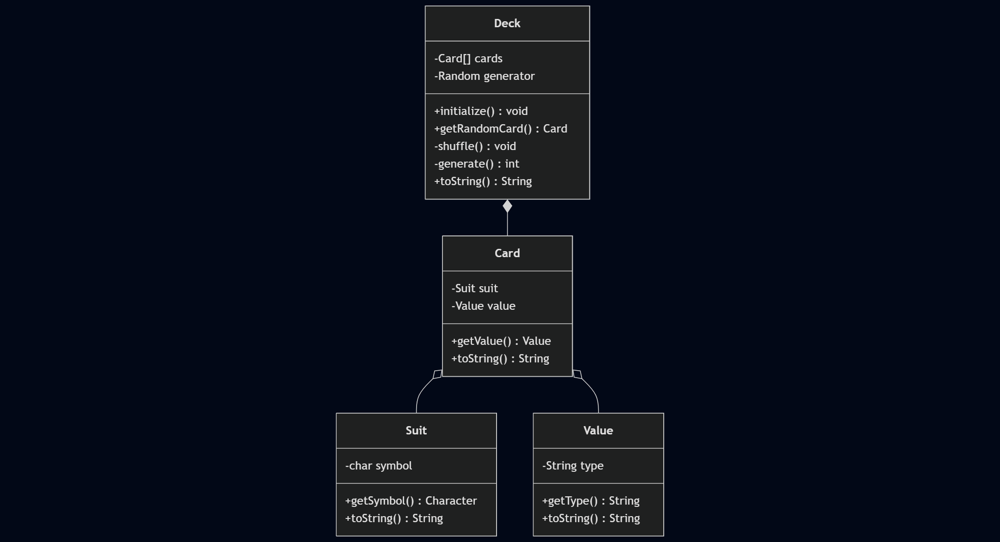
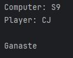
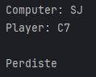
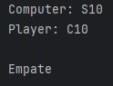

# Act_1_Card_Game

Poker is played with the 52 cards in the deck. 

The cards have the values, in order from lowest to highest: 2, 3, 4, 5, 6, 7, 8, 9, 10, J, Q, K and A.

There are four suits: clubs ♣, diamonds ♦, hearts ♥ and spades ♠. None of which has more value than the other.

## Getting Started

### Install Dependencies
```console
mvn clean install
```

## Workflow

### Flowchart

```
---
title: Card game example
---
classDiagram
    class Suit {
        -char symbol
        +getSymbol() Character
        +toString() String
    }
    class Value {
        -String type
        +getType() String
        +toString() String
    }
    class Card {
        -Suit suit
        -Value value
        +getValue() Value
        +toString() String
    }
    class Deck {
        -Card[] cards
        -Random generator
        +initialize() void
        +getRandomCard() Card
        -shuffle() void
        -generate() int
        +toString() String
    }
  
    Card o-- Suit
    Card o-- Value
    Deck *-- Card
```




### Execution





### References

_Póker: ¿Cómo se Juega y Cuántas Cartas se Dan Para Hacer Escalera?_. (2024, agosto 20). Clarín. https://www.clarin.com/informacion-general/poker-juega-cuantas-cartas-dan-hacer-escalera_0_fEgrAGdWMZ.html?srsltid=AfmBOoqB7pEw4_1mboB-O-jnlsGbkVeVTmtJP2Nd1npmj8k0iT87eAhH

_Random Shuffling of an Array_. (S/f). Stackoverflow.com. Retrieved on 22 July 2025 from https://stackoverflow.com/questions/1519736/random-shuffling-of-an-array/21454317#21454317

_Clasificación de las Jugadas del Poker_. Poker.com.es. Retrieved on 22 July 2025 from https://www.poquer.com.es/ranking.html