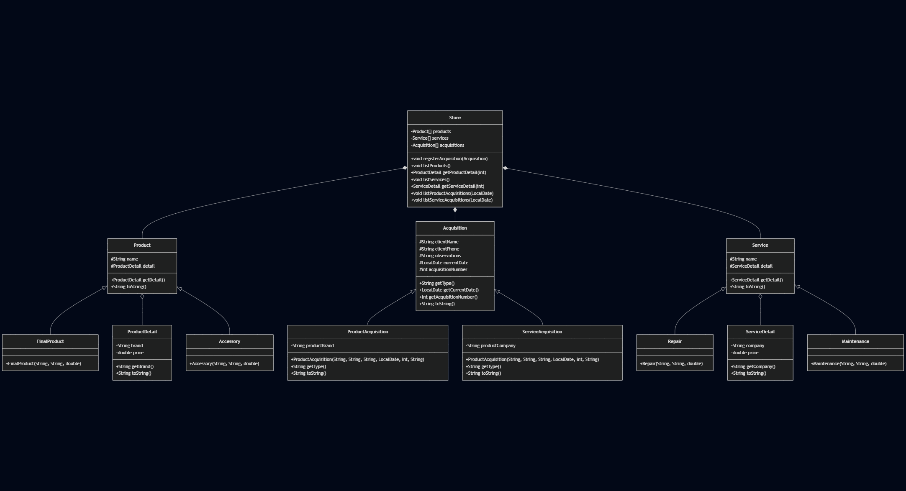
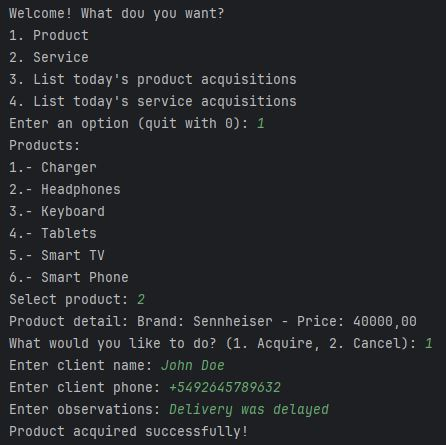
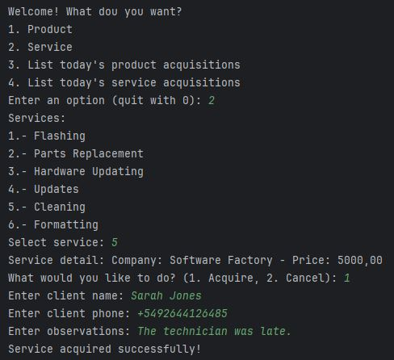
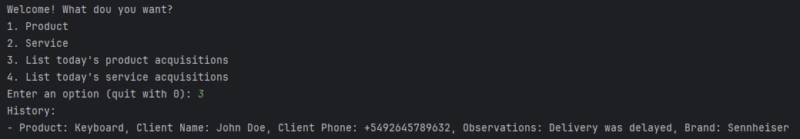
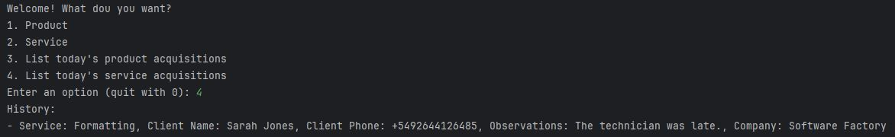

# Act_2_Mobile_Devices

There are three main abstractions: products, services and acquisitions.

Products and services have a detail, and a reference number for their corresponding acquisitions.

## Getting Started

### Install Dependencies
```console
mvn clean install
```

## Workflow

### Flowchart

```
---
title: Mobile devices example
---
classDiagram
    class Product {
        #String name
        #ProductDetail detail
        +ProductDetail getDetail()
        +String toString()
    }

    class ProductDetail {
        -String brand
        -double price
        +String getBrand()
        +String toString()
    }

    class Accessory {
        +Accessory(String, String, double)
    }
    
    class FinalProduct {
        +FinalProduct(String, String, double)
    }

    class Service {
        #String name
        #ServiceDetail detail
        +ServiceDetail getDetail()
        +String toString()
    }

    class ServiceDetail {
        -String company
        -double price
        +String getCompany()
        +String toString()
    }

    class Repair {
        +Repair(String, String, double)
    }
    
    class Maintenance {
        +Maintenance(String, String, double)
    }

    class Acquisition {
        #String clientName
        #String clientPhone
        #String observations
        #LocalDate currentDate
        #int acquisitionNumber
        +String getType()
        +LocalDate getCurrentDate()
        +int getAcquisitionNumber()
        +String toString()
    }

    class ProductAcquisition {
        -String productBrand
        +ProductAcquisition(String, String, String, LocalDate, int, String)
        +String getType()
        +String toString()
    }

    class ServiceAcquisition {
        -String productCompany
        +ProductAcquisition(String, String, String, LocalDate, int, String)
        +String getType()
        +String toString()
    }

    class Store {
        -Product[] products
        -Service[] services
        -Acquisition[] acquisitions
        +void registerAcquisition(Acquisition)
        +void listProducts()
        +ProductDetail getProductDetail(int)
        +void listServices()
        +ServiceDetail getServiceDetail(int)
        +void listProductAcquisitions(LocalDate)
        +void listServiceAcquisitions(LocalDate)
    }

    Product <|-- FinalProduct
    Product o-- ProductDetail
    Product <|-- Accessory

    Acquisition <|-- ProductAcquisition
    Acquisition <|-- ServiceAcquisition

    Service <|-- Repair
    Service o-- ServiceDetail
    Service <|-- Maintenance

    Store *-- Product
    Store *-- Acquisition
    Store *-- Service
```


### Execution




